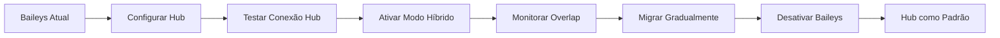
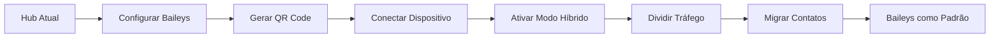

# 🔄 ESTRATÉGIA DE MIGRAÇÃO ENTRE PROVIDERS WHATSAPP

## 🎯 **VISÃO ESTRATÉGICA: FLEXIBILIDADE É O DIFERENCIAL**

O sistema dual de providers oferece **flexibilidade total** para os clientes, permitindo migração transparente entre **Baileys (grátis)** e **Notifica-me Hub (pago/oficial)**.

---

## 📊 **CENÁRIOS DE MIGRAÇÃO**

### **1. Migração Baileys → Hub (Grátis → Pago)**
**Motivos Comuns:**
- ✅ Alta volume de mensagens
- ✅ Precisão de entregabilidade garantida
- ✅ Necessidade de canais extras (Instagram, Facebook, etc.)
- ✅ Conformidade com políticas do WhatsApp
- ✅ Suporte técnico oficial

**Processo de Migração:**


### **2. Migração Hub → Baileys (Pago → Grátis)**
**Motivos Comuns:**
- ✅ Redução de custos
- ✅ Volume baixo de mensagens
- ✅ Testes e desenvolvimento
- ✅ Mudança de estratégia de negócio

**Processo de Migração:**


### **3. Migração Híbrida (Ambos Simultâneos)**
**Cenário Ideal:**
- 🔄 **Baileys**: Mensagens transacionais (grátis)
- 🔄 **Hub**: Marketing e multicanal (pago)
- 🔄 **Failover**: Backup automático
- 🔄 **Distribuição Inteligente**: Por tipo de mensagem

---

## 🛠️ **ESTRATÉGIAS TÉCNICAS DE MIGRAÇÃO**

### **Estratégia 1: Overlap Gradual (Recomendado)**
```typescript
// Fase 1: Overlap de 7 dias
class MigrationService {
  async gradualMigration(fromType: string, toType: string): Promise<void> {
    // Dia 1-3: 70% Provider A, 30% Provider B
    // Dia 4-5: 50% Provider A, 50% Provider B
    // Dia 6-7: 30% Provider A, 70% Provider B
    // Dia 8+: 100% Provider B
  }

  async distributeMessages(tenantId: number, message: Message): Promise<void> {
    const distribution = await this.getDistributionRatio(tenantId);

    if (Math.random() < distribution.providerA) {
      await this.sendViaProviderA(message);
    } else {
      await this.sendViaProviderB(message);
    }
  }
}
```

### **Estratégia 2: Perfil de Cliente**
```typescript
// Migração baseada no perfil do cliente
async smartMigration(tenantId: number): Promise<'baileys' | 'hub'> {
  const metrics = await this.getTenantMetrics(tenantId);

  if (metrics.monthlyMessages > 10000) {
    return 'hub'; // Alto volume → Hub
  }

  if (metrics.channelsNeeded > 1) {
    return 'hub'; // Múltiplos canais → Hub
  }

  if (metrics.budget < 100) {
    return 'baileys'; // Orçamento limitado → Baileys
  }

  return 'baileys'; // Padrão → Baileys
}
```

### **Estratégia 3: Baseada em Performance**
```typescript
// Migração baseada em performance do provider
class PerformanceMonitor {
  async monitorProviderPerformance(type: string): Promise<ProviderScore> {
    return {
      deliveryRate: await this.getDeliveryRate(type),
      responseTime: await this.getAvgResponseTime(type),
      uptime: await this.getUptime(type),
      errorRate: await this.getErrorRate(type)
    };
  }

  async shouldMigrate(from: string, to: string): Promise<boolean> {
    const fromScore = await this.monitorProviderPerformance(from);
    const toScore = await this.monitorProviderPerformance(to);

    return toScore.overall > fromScore.overall * 1.2; // 20% melhor
  }
}
```

---

## 📋 **CHECKLIST DE MIGRAÇÃO**

### **Pré-Migração**
```markdown
- [ ] Backup completo de mensagens e contatos
- [ ] Validação de créditos do Hub (se aplicável)
- [ ] Teste de conexão com provider de destino
- [ ] Configuração de webhooks e callbacks
- [ ] Planejamento de janela de manutenção
- [ ] Comunicar clientes sobre possível indisponibilidade
- [ ] Preparar script de rollback
```

### **Durante Migração**
```markdown
- [ ] Monitorar taxas de entrega em tempo real
- [ ] Verificar logs de erro constantemente
- [ ] Testar envio de mensagens em ambos os providers
- [ ] Validar recebimento de webhooks
- [ ] Confirmar integridade de dados
- [ ] Manter comunicação com suporte do provider
```

### **Pós-Migração**
```markdown
- [ ] Validar todas as funcionalidades
- [ ] Coletar feedback dos usuários
- [ ] Analisar métricas de performance
- [ ] Ajustar configurações se necessário
- [ ] Documentar lições aprendidas
- [ ] Arquivar configurações do provider antigo
```

---

## 🚨 **PLANO DE ROLLBACK**

### **Rollback Automático**
```typescript
class RollbackService {
  private rollbackThreshold = {
    errorRate: 0.1, // 10% de erro
    deliveryRate: 0.8, // 80% de entrega
    responseTime: 5000 // 5 segundos
  };

  async monitorAndRollback(tenantId: number): Promise<void> {
    const metrics = await this.getMigrationMetrics(tenantId);

    if (this.shouldRollback(metrics)) {
      console.error(`[Rollback] Triggering automatic rollback for tenant ${tenantId}`);
      await this.executeRollback(tenantId);
    }
  }

  private shouldRollback(metrics: MigrationMetrics): boolean {
    return (
      metrics.errorRate > this.rollbackThreshold.errorRate ||
      metrics.deliveryRate < this.rollbackThreshold.deliveryRate ||
      metrics.avgResponseTime > this.rollbackThreshold.responseTime
    );
  }

  async executeRollback(tenantId: number): Promise<void> {
    // 1. Parar envios pelo novo provider
    await this.stopProvider(tenantId, 'new');

    // 2. Restaurar configurações do provider antigo
    await this.restoreProviderConfig(tenantId, 'old');

    // 3. Reativar provider antigo
    await this.activateProvider(tenantId, 'old');

    // 4. Notificar equipe
    await this.notifyRollback(tenantId);
  }
}
```

### **Rollback Manual**
```bash
# Script de emergência para rollback
#!/bin/bash

rollback_provider() {
  local tenant_id=$1
  local backup_date=$2

  echo "🔄 Rollback for tenant ${tenant_id}"

  # 1. Parar processos
  pm2 stop ${tenant_id}-backend

  # 2. Restaurar .env backup
  cp /backups/env-${tenant_id}-${backup_date} /home/deploy/${tenant_id}/backend/.env

  # 3. Restaurar banco
  psql -U postgres -d whaticket_${tenant_id} < /backups/db-${tenant_id}-${backup_date}.sql

  # 4. Reiniciar serviços
  pm2 restart ${tenant_id}-backend

  # 5. Verificar status
  pm2 status ${tenant_id}-backend

  echo "✅ Rollback completed for tenant ${tenant_id}"
}
```

---

## 📈 **MÉTRICAS DE SUCESSO DA MIGRAÇÃO**

### **KPIs Técnicos**
- ✅ **Taxa de Entrega**: > 95%
- ✅ **Tempo de Resposta**: < 2 segundos
- ✅ **Uptime**: > 99.9%
- ✅ **Taxa de Erro**: < 1%
- ✅ **Webhook Delivery**: > 98%

### **KPIs de Negócio**
- ✅ **Satisfação Cliente**: > 90%
- ✅ **Zero Quebra de Serviço**: Durante migração
- ✅ **ROI Esperado**: Conforme planejado
- ✅ **Adoção**: > 80% das novas funcionalidades

### **Alertas e Monitoramento**
```typescript
const migrationAlerts = {
  critical: {
    'delivery_rate_below_80': 'Taxa de entrega abaixo de 80%',
    'error_rate_above_10': 'Taxa de erro acima de 10%',
    'service_unavailable': 'Serviço indisponível por mais de 5 minutos'
  },
  warning: {
    'delivery_rate_below_90': 'Taxa de entrega abaixo de 90%',
    'response_time_above_3s': 'Tempo de resposta acima de 3 segundos'
  }
};
```

---

## 💡 **CASOS DE USO RECOMENDADOS**

### **Use Baileys (Grátis) quando:**
- 🎯 **Volume**: Até 5.000 mensagens/mês
- 💰 **Orçamento**: Limitado ou gratuito
- 👥 **Equipe**: Pequena (1-5 atendentes)
- 📊 **Simplicidade**: Apenas WhatsApp necessário
- ⚡ **Velocidade**: Setup rápido

### **Use Hub (Pago) quando:**
- 🎯 **Volume**: Acima de 5.000 mensagens/mês
- 💰 **Orçamento**: Pode arcar com custos
- 👥 **Equipe**: Média/grande (5+ atendentes)
- 📊 **Multi-canal**: Instagram, Facebook, etc.
- 🏢 **Enterprise**: Necessita de garantias
- 🔒 **Conformidade**: Requer API oficial

### **Use Híbrido (Ambos) quando:**
- 🎯 **Flexibilidade**: Quer testar ambos
- 💰 **Otimização**: Maximizar benefícios
- 👥 **Grande Equipe**: Diferentes departamentos
- 📊 **Complexidade**: Múltiplos casos de uso
- 🔄 **Transição**: Migração gradual

---

## 🎯 **CONCLUSÃO E RECOMENDAÇÕES**

### **Vantagens do Sistema Dual:**
1. **Flexibilidade Máxima**: Cliente escolhe o melhor para seu caso
2. **Zero Vendor Lock-in**: Pode mudar quando quiser
3. **Otimização de Custos**: Paga só o que usa
4. **Mitigação de Riscos**: Backup automático
5. **Escala Progressiva**: Cresce com o negócio

### **Implementação Recomendada:**
1. **Começar com Baileys** (grátis) para novos clientes
2. **Monitorar Uso**: Identificar necessidade de upgrade
3. **Oferecer Migração**: Quando atingir limites
4. **Manter Opção**: Cliente pode voltar se quiser
5. **Educar Continuamente**: Sobre benefícios de cada provider

**O sistema dual de providers transforma uma limitação técnica em uma vantagem competitiva estratégica!**